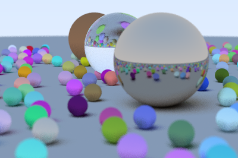

<center>
    <h1>Aya Raytrace Demo</h1>
    
</center>

An implementation of [Ray Tracing in One Weekend By Peter Shirley](https://raytracing.github.io/).  

*Note: This repo implements the brute-force algorithm from book 1 only and is quite slow.*

Requires aya >= `0.6`  
You can get aya from here: https://github.com/aya-lang/aya/releases 

## Install

If you have aya installed on your path:

```
aya pkg add nick-paul/raytrace_demo.aya
```

Otherwise run this from within aya

```
aya> import pkg
aya> "nick-paul/raytrace_demo.aya" pkg.add
```

## Run

```
aya -p raytrace_demo
```

OR

```
aya> import pkg
aya> "raytrace_demo" pkg.run
`
